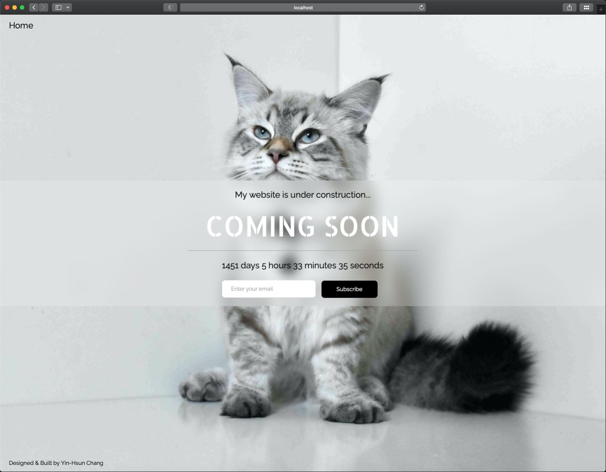

# Coming Soon Landing Page

A visually appealing "Coming Soon" landing page built with Vite, React, and TypeScript. It features an animated slideshow, typing effect, countdown timer, email subscription, and a fully responsive layout—ideal for product launches or personal brands.

All photos were taken and edited by me, highlighting a combination of my photography skills and modern frontend development expertise.

---

## Demo

[](https://yinhsunchang.github.io/coming-soon)

---

## Features

- Smooth loading intro animation
- Full-screen background slideshow with smooth cross-fade transitions
- Original cat images taken and retouched by me
- Glassmorphism UI panel
- Fully responsive layout
- Responsive typography using CSS clamp()
- Typewriter text animation with rotating messages
- Live countdown timer (days / hours / minutes / seconds)
- Email subscription form including basic validation and mock API requests

---

## Tech Stack

- Frontend: Vite, React, TypeScript
- Styling: CSS
- Fonts & Icons: Google Fonts, Font Awesome

---

## Getting Started

Follow the steps below to run the project locally.

```bash
# 1. Clone the repository
git clone https://github.com/yinhsunchang/coming-soon.git
cd coming-soon

# 2. Install dependencies
npm install

# 3. Run the development server
npm run dev
```

---

## Possible Improvements

- Dark / Light theme toggle
- Multi-language support
- Real email subscription service

---

## License, Copyright & Credits

- Code License: MIT License © Yin-Hsun Chang. See the [LICENSE](LICENSE) file for details.
- Images & Media: © Yin-Hsun Chang. All images and media files are not covered by the MIT License and may not be used without permission.
- Third-Party Resources: This project uses third-party resources, which are subject to their respective licenses. Examples include: Google Fonts, Font Awesome
- Design Reference: Inspired by the W3Schools "Coming Soon" template.
